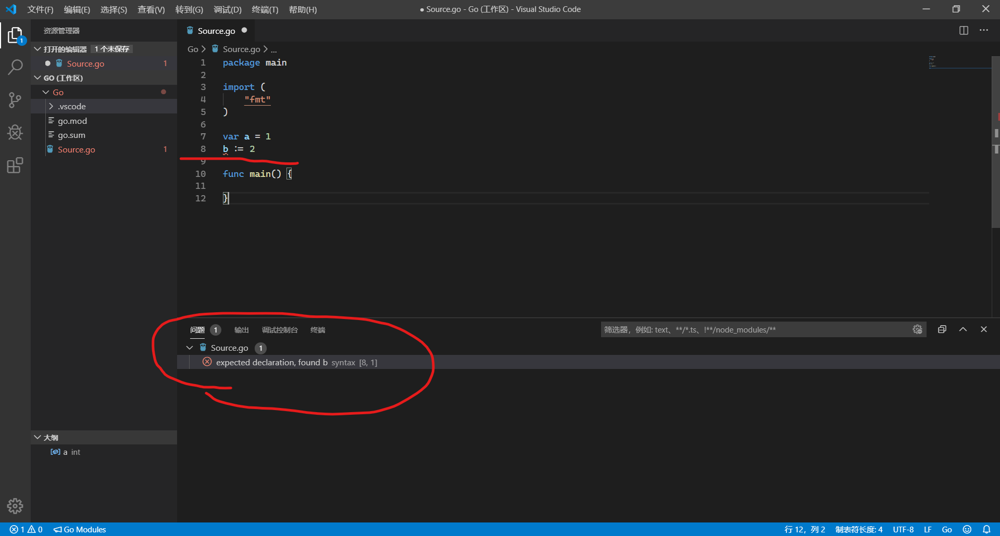

# 初探Golang

## GO语言特点

1. 可直接编译成机器码，不依赖其它的库文件(C++的程序依赖动态库/静态库)

2. 编译速度极快，又有着比较优秀的代码执行速度

3. 语言为静态的，但又有一些动态语言的感觉，写代码效率高，代码的大部分错误可以在编译期间检查出来

4. 语言层面支持并发，用起来丝滑流畅

5. 支持跨平台编译，内置runtime运行时，可以在运行期间抛出难以预料的错误并进行处理

6. 官方给出了代码的标准格式，每个人看到的GO语言源码都是一样的，不存在看不惯的问题

7. 内置GC机制，不用像C或者C++那样malloc/free \\ new/delete需要成对出现

## GO语言版Hello World

    package main

    import "fmt"

    func main() {
        fmt.Print("Hello World!")
    }

我们先不看上面的**package main**语句，下面的 import "fmt"语句就和python很像，其作用就是导入一个包，它的名字是**fmt**，**fmt包**就是Go语言中的stdio.h/iostream，在使用包内的函数时，要严格遵守**包名.函数名**的格式。main函数内就是一个调用了fmt包中Print函数。

import可以使用类似于下面的语句同时导入多个包

    import (
        "fmt"
        "math"
    )

对于一整个语句，应该写在同一行(行末不需要写分号)，Go语言使用花括号来切分语句块，没有类似于python缩进不对程序就没法执行的问题。当然，使用官方的gofmt工具会强制地将你写的代码格式化成官方格式。

## Go语言与C语言的区别

看了上面的Hello World示例，是不是觉得Go语言和C语言比较相似呢。下面我就来讲一下Go语言与C语言的相同点和不同点。

首先是Go语言对于可导出变量和不可导出变量的区分，Go语言使用首字母大小写来表明当前的变量对于外部文件是否可见。C语言则使用头文件中的extern声明。

    //math中有一个名为p0R8的变量，其为小写字母开头。
    //下面我们尝试输出变量的值
    package main

    import (
        "fmt"
        "math"
    )

    func main() {
        fmt.Print(math.p0R8)   //将这行注释掉，试试下面的句子 fmt.Print(math.Pi)
    }

其次，是一个看似奇葩的变量声明/定义的方法

    var a int = 5    //前面写var 变量名后写变量类型
    
    func add(x int, y int) int {  //分别形参表后接返回值类型
        return x + y
    }

    //下面是简单的变量定义方法
    var a = 5               //编译时编译器自动猜测变量a的类型
    const b = 5             //常量的定义，没有变量类型，其为常量，没有“类型”

下面解释一下为啥要有这种看似奇葩的变量定义方法

Golang官方的解释人工翻译版：

下面是一个C语言的变量定义方法

    int x;

下面是基于int衍生出的变量类型

    int *p;
    int a[3];

是不是还能搞明白

那再来看看下面的变量定义

    int (*fp)(int a, int b);

这里定义了一个返回值类型为int，形参表为int int的变量fp，它是一个函数指针
感觉咋样，如果还能接受的话，那再看看下面的变量定义

    int (*fp)(int (*ff)(int x, int y), int b)

看起来是不是都很费劲，上面的变量定义还能看得更费劲

    int (*fp)(int, int);
    int (*fp)(int (*)(int, int));

看起来就费劲很多了吧

让我们来看一下Go语言中是咋写的

    var fp func(int ,int) int
    var fp func(func(int, int) int)

其实这样看起来也只是好一点吧

其实Go语言里面可以这么写

    var fp = functionName

简单很多了吧

还能这么写

    fp := funtionName

对，学会用这个就行了，超级简单的

当然使用上面的超简单语句有一个前提：人家得是局部变量。不能把它写在全局变量声明中。

## 函数的定义

函数定义都不用怎么教，C语言怎么定义，Go也是差不多的形式

    package main

    import "fmt"

    func add(a, b int) int {
        return a + b
    }

    func main() {
        fmt.Print(add(1, 2))
    }

这里是一种简单的写函数方法，如果形参表中，两个变量的类型相同，那么，我们可以省略前者的变量类型声明。

而且，相对于C语言中那种死板的先声明/定义才能调用自定义函数的做法。Go语言对它进行了化简，我们可以选择在调用此函数的语句下方对函数进行定义。

    package main

    import "fmt"

    func main() {
        fmt.Print(add(1, 2))
    }

    func add(a, b int) int {
        return a + b
    }

我们还可以使用以下的写法

    package main

    import "fmt"

    func main() {
        fmt.Println(add(1, 2))
    }

    func add(a, b int) (x int) {  //使用括号声明返回值名称，在下面写return时就不需要写返回的变量名了
        x = a + b
        return
    }

不推荐在很长的函数定义中这么写，太反人类了，看个返回值还得去看函数头，不被其它程序员打死。。。  

与Python一样，Go也支持多值返回

    package main

    import "fmt"

    func main() {
        a, b := strSplit("Hello World")
        fmt.Printf("%s\n%s\n", a, b)
    }

    func strSplit(str string) (string, string) {
        for i = range str {
            if str[i] == ' ' {
                return str[:i], str[i+1:]
            }
        }
        return str, ""
    }

上面的strSplit还可以这么写

    func strSplit(str string) (string, string) {
        for i, ch := range str {
            if ch == ' ' {
                return str[:i], str[i+1:]
            }
        }
        return str, ""
    }

比如我想打印字符串中的每一个字符，那可以使用下划线 **\_** 来忽略第一个返回值，Python里面也有这个哦

    func printStr(str string) {
        for _, ch := range str {
            fmt.Printf("%c ", ch)
        }
    }

这还不是最神奇的东西，经过前面几次python的教学。我想一部分同学大概已经知道Python里面是可以在函数内定义函数的。

    package main

    import "fmt"

    func main() {
        fibo := fibonacci()
        fmt.Println(fibo())
        fmt.Println(fibo())
    }

    func fibonacci() func() int {
        a := 0
        b := 1
        fi := func() int { //隐式定义
            a, b = b, a+b
            return b
        }
        return fi
    }

## 变量

变量这边就主要讲讲var这个关键字

var用于声明一个变量列表，和前面的import语句一样，有下面几种写法

    var a, b, c int

    //使用圆括号包围，同时声明多种类型的变量
    var (
        a, b int     //a, b都等于0
        c, d string  //都为空字符串
    )

    //可以对变量赋初值，如果不赋初值，编译器会自动给变量赋一个默认值，这点比C语言好很多~
    var (
        a, b int = 1, 2
        c, d string = "Hello", "World"
    )

    var a, b, c = 1, 2, "Hello World"  //最简单的赋值方法(全局变量)

## 强制类型转换

这个和C++/Python里面的写法完全一样，C语言嘛，有一丝不同

    package main

    import "fmt"

    func main() {
        a := 1.0
        var b  int = int(a)
        fmt.Print(b)
    }

不过它和C/C++还是有差异的，人家只允许显式的强制类型转换，上面的语句是不能把int()省略的  
这么做写代码看似麻烦了一点，但对于看代码的人来说就很舒服了

在C语言中，我们可能这么写

    int a;
    double b = 2.5;
    
    //many lines here

    a = b;  //a = b???

遇到问题了吧，a可能是一个double类型，也有可能是int类型，甚至是bool类型，你咋知道a被赋值后到底是什么值，看起来很费劲。

如果要求全部都写强制类型转换，就没有这种坑爹问题了。

## for循环

1. for \<表达式1\>; \<表达式2\>; \<表达式3\>

    这个和C语言里面的完全一样，就不细讲了

2. for index, val in range var

    index是索引，val是可迭代变量中的值，后面的var就是一个可迭代对象

        package main

        import "fmt"

        var a = [...]int{1, 2, 3, 4, 0, 6}  //定义了一个数组

        func main() {
            for _, val := range a {
                fmt.Println(val)
            }
        }

3. for \<表达式\>

    这里的表达式得返回一个bool类型的值，和C语言中的while是一样的。  

    Go语言中没有while语句，只有for。。。  
    下面是一个简单的栗子

        package main

        import "fmt"

        func main() {
            sum := 1
            for sum < 1000 {  //也可以省略表达式，那就是一个死循环
                sum += sum
            }
            fmt.Println(sum)
        }

## switch语句

switch语句在Golang里面就是一个外挂般的存在

先看一个**红马甲**版本

    package main

    import "fmt"

    func main() {
        str := [...]string{"Hello", "World", "Github"}
        for _, s := range(str) {
            switch s {
            case "Hello":
                fmt.Println(1)
            case "World":
                fmt.Println(2)
            case "Github":
                fmt.Println(3)
            }
        }
    }

Golang的switch语句是可以使用字符串常量、浮点数的。没有C语言那种**限制(文明用语,自动屏蔽不良词汇)  
而且，它自动地给你在每一个case结束处加上了"break"，非常舒服  

下面这个是**黄马甲**版本

    package main

    import "fmt"

    func main() {
        for a := 0; a < 10; a++ {
            switch {  //注意，这里不用写选定的变量
            case a%2 == 0:
                fmt.Printf("%d是个偶数\n", a)
            case a%2 != 0:
                fmt.Printf("%d是个奇数\n", a)
            }
        }
    }

但有时我们就想让switch case语句向下执行，不自动break。那就得在case语句结束的地方加上**fallthrough**

## 正题

其实上面全是废话，接下来，我们进入所谓的正题

### 1.切片和数组

在Go语言中，切片是切片，数组是数组，它们不一样

    package main

    import "fmt"

    func main() {
        a := [...]int{1, 2, 3}
        s := []int{1, 2, 3}
        fmt.Printf("a's type is %T\ns' type is %T", a, s)
    }

这里的切片与python中的一样，底层也是使用数组实现的，但它不像python，Go有原生的数组支持，python中需要使用numpy等才能得到一个数组。

数组就不讲了，下面讲讲切片  

在Go中，切片也有两个属性，一个是容量，一个是长度

下面举一个形象的栗子

    a := []int{1, 2, 3, 4, 5, 6, 7, 8}
    fmt.Println("初始长度为", len(a))
    a = a[:5]
    fmt.Println("当前长度为", len(a))
    // 在此处尝试以下语句
    // a[6] = 5
    a = a[:8]
    fmt.Println("还原其长度后", len(a))

尝试修改a[6]的值后，Go的runtime将会触发一个异常。因为此时切片索引已经超出了切片的长度。  
下面的a = a[:8]呢，则将切片还原成了它原始的长度，但其值不能超过切片的容量

我们可以使用cap()来获取切片的容量

    package main

    import "fmt"

    func main() {
        a := make([]int, 5, 10)  //使用make创建一个长度为5容量为10的int切片
        fmt.Println(len(a))
        fmt.Println(cap(a))
    }

将切片长度扩展到其容量的最好方法是

    a = a[:cap(a)]

切片的容量没法扩展，但我们可以使用内置的append方法来获得一个容量更大的切片

    package main

    import "fmt"

    func main() {
        a := make([]int, 5)
        a = append(a, 4)  //在当前切片的末尾添加一个值 5
        fmt.Print(a)
    }

append会返回一个长度增长为n的切片 n取决于append的元素数量

### 2.Golang的typedef

关键字为type

比如

    package main

    import "fmt"

    type i int

    func main() {
        var a i = 5
        fmt.Printf("%T", a)  //类型为main.i
    }

类似于上面的做法在Go中非常常见，在讲原因之前，我们先来看一下下面的语句

    //定义结构体
    type st struct {
        x, y int  //请不要在变量名前加var关键字
    }

如果我想计算结构体中x与y之积，而且这个东西将被经常用到，那么，我可以写一个方法来获得其值。学C++的同学此时应该感到开心，因为这个和类挺像的。

我们先定义一个方法

    func (v st) multiply() int {
        return v.x * v.y
    }

然后在main中创建一个st变量并调用之

    func main() {
        var a st = st{3, 2}
        fmt.Print(a.multiply())
    }

下面这个可能有点难理解，看之前可以先想一下C语言中的函数传参

    func (v *st)double() {  //运行一次后尝试将星号去掉
        v.x = v.x * 2  //自动将v.x --> (*v).x
        v.y = v.y * 2
    }

    func main() {
        var a = st{1, 2}
        a.double()
        fmt.Print(a)
    }

两次的结果应该为

    {2 4}
    {1 2}

这就是指针传递和值传递的差别  
在调用该方法时，编译器自动地将a.double()转换成了(&a).double() 简化了代码的编写

我们现在回到第一个例子

    type i int

这么写有啥用呢，那就是我们可以自己定义int的方法，来实现自己想要实现的功能。
我现在给出一道题目：

    使用的方法：(v i) p()
    实现打印从0到v的值

    例如我定义一个变量为
    var num i = 5
    当我调用 num.p()时，屏幕上应该打印出 0 1 2 3 4 5
    
    可能需要用到强制类型转换 a := i(0)

这个任务还算比较简单吧，上面的例子其实也说明了为啥要有type i int这样的写法：  
只有我们使用类型转换后，我们才可以自定义类型方法，并且实现对相应类型方法的调用，如果我们将上面自定义方法中的 ***i*** 换成 ***int*** ，编译器就会直接报错。

### 3.接口

1. 接口是个啥？

    接口这东西吧，看起来很复杂，其实也就很复杂。  
    我是开玩笑的

    接口其实就是把具有共性的方法写在了一起，比如我现在写了int类型还有float32类型的方法，方法名一样，那我可以写一个接口，方便别人调用。咋叫方便别人调用呢？

    这边有一个非常好的例子

        package main
        import (
            "fmt"
        )

        type sorter interface { //sort函数的接口，我们只要实现下面的三个方法，就能对sort进行调用
            Len() int
            Less(i, j int) bool
            Swap(i, j int)
        }

        type Xi []int
        type Xs []string
        func (p Xi) Len() int               { return len(p) }
        func (p Xi) Less(i int, j int) bool { return p[j] < p[i] }
        func (p Xi) Swap(i int, j int)      { p[i], p[j] = p[j], p[i] }
        func (p Xs) Len() int               { return len(p) }
        func (p Xs) Less(i int, j int) bool { return p[j] < p[i] }
        func (p Xs) Swap(i int, j int)      { p[i], p[j] = p[j], p[i] }

        func sort(x sorter) {
            for i := 0; i < x.Len()-1; i++ {
                for j := i + 1; j < x.Len(); j++ {
                    if x.Less(i, j) {
                        x.Swap(i, j)
                    }
                }
            }
        }

        func main() {
            ints := Xi{44, 67, 3, 17, 89, 10, 73, 9, 14, 8}
            strings := Xs{"nut", "ape", "elephant", "zoo", "go"}
            sort(ints)
            fmt.Printf("%v\n", ints)
            sort(strings)
            fmt.Printf("%v\n", strings)
        }

2. 接口能干嘛

    下面有一个小例子

        package main

        import "fmt"

        // type i int
        // type d float32

        //I 是一个没有包含任何方法的接口(空接口)
        type I interface {}

        func main() {
            describe(1)
            describe(2.5)
        }

        func describe(i I) {
            fmt.Printf("%v, %T\n", i, i)
        }

    我写了个接口，它叫I，它的作用是承载变量的值以及其类型，使得我能够通过describe函数来获取它的值以及类型。学C++的有没有发现它和函数模板很像。

    这算是函数的复用，接口指定的方法我们都需要去实现。然后我们就可以去调用使用了特定接口的函数了。比如上面的那个sort还有describe。

    第二个小例子，学C++的应该还记得输入输出流的运算符重载吧~  
    (来自Go指南)

        package main

        import "fmt"

        type IPAddr [4]byte

        func (v IPAddr) String() string {
            return fmt.Sprintf("%d.%d.%d.%d", v[0], v[1], v[2], v[3])
        }

        func main() {
            hosts := map[string]IPAddr{
                "localhost":  {127, 0, 0, 1},
                "googleDNS": {8, 8, 8, 8},
            }
            for name, ip := range hosts {
                fmt.Printf("%v: %v\n", name, ip)
            }
        }

### 4.原生的多线程

Go语言对多线程进行了原生的支持，写起来也非常简单。  
当我们要创建一个新的线程时，像下面这么写就ok

    package main

    import (
        "fmt"
        "time"
    )

    func say(s string) {
        for i := 0; i < 5; i++ {
            time.Sleep(100 * time.Millisecond)
            fmt.Println(s)
        }
    }

    func main() {
        go say("world") //创建新的线程
        say("hello")
    }

可以看看输出结果是咋样的  
看完了以后，试试在say("hello")前也加上go

为什么会这样呢？

是这样的，当你同时开启两个新线程后，主线程main并没有等待前面两个say word的线程结束就已经退出了，上面两个创建的线程也就没法把消息打印到屏幕上了。想要得到输出，可以这么写

    package main

    import (
        "fmt"
        "sync"
        "time"
    )

    var wg sync.WaitGroup

    func say(s string) {
        for i := 0; i < 5; i++ {
            time.Sleep(100 * time.Millisecond)
            fmt.Println(s)
        }
        wg.Done()
    }

    func main() {
        wg.Add(2) //waitGroup内等待的线程数加2
        go say("world")
        go say("hello")
        wg.Wait() //等待所有的线程结束
    }

请不要使用下面的写法

    package main

    import (
        "fmt"
        "sync"
        "time"
    )

    var wg sync.WaitGroup

    func say(s string) {
        wg.Add(1)
        for i := 0; i < 5; i++ {
            time.Sleep(100 * time.Millisecond)
            fmt.Println(s)
        }
        wg.Done()
    }

    func main() {
        go say("world")
        go say("hello")
        wg.Wait()
    }

因为使用这种写法，你很有可能遇到main线程已经执行到wg.Wait()了，但你的子线程还没有运行到wg.Add(1)
