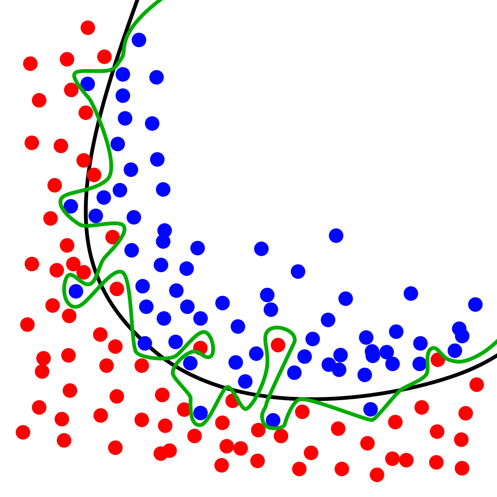

# 初窥Tensorflow

- [初窥Tensorflow](#初窥tensorflow)
  - [Tensorflow简介](#tensorflow简介)
  - [Tensorflow安装](#tensorflow安装)
    - [验证tensorflow安装](#验证tensorflow安装)
  - [tensorflow.keras介绍](#tensorflowkeras介绍)
  - [Tensorflow使用](#tensorflow使用)
    - [数据预处理](#数据预处理)
      - [读入数据](#读入数据)
      - [生成字向量字典](#生成字向量字典)
      - [将语句转成字向量](#将语句转成字向量)
      - [序列长度统一](#序列长度统一)
    - [模型构建](#模型构建)
      - [激励函数](#激励函数)
      - [Dropout](#dropout)
      - [全连接神经层](#全连接神经层)
      - [softmax](#softmax)
    - [compile](#compile)
    - [train](#train)
      - [查看summary](#查看summary)
      - [save model](#save-model)
    - [查看log](#查看log)
    - [模型的使用](#模型的使用)
  - [结束语](#结束语)

## Tensorflow简介

TensorFlow 是一个端到端开源机器学习平台。它拥有一个包含各种工具、库和社区资源的全面灵活生态系统，可以让研究人员推动机器学习领域的先进技术的发展，并让开发者轻松地构建和部署由机器学习提供支持的应用。——[tensorflow.google.cn](https://tensorflow.google.cn)

上面那个是tensorflow官网的介绍，我下面就从自己的角度介绍一下tensorflow：

1. Tensorflow是一个“机器学习操作系统”，操作系统干的事情就是将底层驱动与用户使用层进行隔离，有一定的资源开销，但提高了使用效率。相对于上一次培训江部长演示的复杂的构建神经网络的方法，使用tensorflow将会极大地减少构建神经网络所花费的时间。

2. Tensorflow是一个生态较为完善的机器学习框架，就像x86架构在云计算平台完善的生态促成开发者继续在这个平台上开发应用一样。Tensorflow完善的生态，可以让使用者方便地调用它内部集成的模块来构建、训练和验证自己的模型，这也使得网络上出现了更多的Tensorflow教程，方便初学者入门

3. 特别是Tensorflow2.0带来的eager execution和keras使得其语法更加接近Python，调用变得更加简单，虽然集成keras让其被许多开发者吐槽，但不得不说，keras是真的香。

## Tensorflow安装

Tensorflow有两种版本，一种是cpu版本 tensorflow，一种是gpu版本 tensorflow-gpu，目前，gpu版本仅支持主流的Nvidia显卡(gpu版本需要安装cuda驱动)

1. 设置pypi镜像

    如果觉得pip下载过慢，可以将pypi源更换为国内镜像：阿里云镜像、豆瓣镜像、清华镜像等等  
    下面举一个换阿里云镜像的例子  
    打开资源管理器，在地址栏输入：%APPDATA%，按回车  
    然后新建文件夹，重命名为：pip  
    进入pip文件夹，新建文本文档，重命名为：pip.ini
    右键编辑，将已下内容复制进去，然后保存

        [global]
        index-url = https://mirrors.aliyun.com/pypi/simple/

        [install]
        trusted-host=mirrors.aliyun.com

    

2. pip安装

    CTRL+R输入CMD并回车，在命令行中输入

        //cpu版本
        pip install tensorflow
        //GPU版本
        pip install tensorflow-gpu

    即可快速安装tensorflow，gpu版本需要去Nvidia官网下载CUDA10.0和CUDNN(需下载CUDA10.0版本的)(对于tensorflow2.0稳定版)

### 验证tensorflow安装

在命令行中输入

    python
    import tensorflow

如果能够正常导入tensorflow，则说明安装成功

## tensorflow.keras介绍

因为培训的时间有限，我就在这里介绍一下今天的培训会使用到的高级API——Keras。

keras是一个用Python编写的高阶神经网络API，我们可以像搭乐高一样方便地将神经网络模型构建出来。因为它实在是太好用了，所有它现在已经被集成到了tensorflow2.0中，作为一个高阶API存在。而且它是一个用过的人都说好的存在。。。

这次培训，我们将会用到keras中的以下几个API：Sequential、layers、以及preprocessing。我在这里就不作具体介绍了，想要了解tensorflow内置API的同学可以访问[Tensorflow官网](https://tensorflow.google.cn)了解有关API。

## Tensorflow使用

本次培训，我将会使用一个文本分类(情感分析：positive or negative)的例子来介绍Tensorflow的使用。

我推荐使用Jupyter notebook编写机器学习的代码，也可以选择在线的Jupyter notebook平台[Kaggle kernels](https://www.kaggle.com/kernels)，选择在线平台时最好选择注册并登录账户，这样可以免费使用GPU。

### 数据预处理

#### 读入数据

首先导入我们需要使用的几个python包

    import tensorflow as tf
    from tensorflow import keras
    from tensorflow.keras import layers
    import pickle
    import numpy as np

接着，我们将文本数据读入后存入列表，在读入列表的同时，我们将其标签存入标签列表，标签有两个，一个是positive，一个是negative，对于文本分类的应用，使用one-hot设置标签较为合适。文本数据下载（右键链接，选择另存为）：[negative.txt](./Source/negative.txt)、[positive.txt](./Source/positive.txt)

| 数据标签 |one-hot编码|
| ------ | ------ |
|positive| [1, 0] |
|negative| [0, 1] |

    word_list = []   # 文本列表
    label_list = []  # 文本标签

    with open('/content/negative.txt') as fp:  # 读入文本文档中的数据
    for line in fp.readlines():
        word_list.append(line.replace('\n', ''))  # 将文本存入word_list
        label_list.append([0, 1])                 # 将标签存入label_list

    with open('/content/positive.txt') as fp:
    for line in fp.readlines():
        word_list.append(line.replace('\n', ''))
        label_list.append([1, 0])

#### 生成字向量字典

因为神经网络只能处理矩阵数据，而我们读入的文本不是矩阵，所以，我们需要对文字进行编码，使其适合神经网络训练。

在这一步上，我们有两种方法，一种是将每一个文字转换成one-hot编码，虽然对于神经网络来说，one-hot可以体现文字的关系，但其非常的占用空间，如果你有100个文字，那你就需要一个100维的向量，但对于每一个文字，这个向量中只有一个值为1，其它都是0，这会造成空间的浪费，当文字的数量非常大时，我们就无法使用这种方法来对文字进行编码了。

相对于one-hot编码，我们使用自然数标签就可以充分利用空间了，但自然数标签有一个很大的问题：在神经网络中，有许多求加权平均的操作，那会就会出现以下的情况：1代表我，2代表你，3代表他，那么，当神经网络中的一次训练出现了1+2/2这样的求平均操作时，就会得到一个2，但这个数字代表的"你"不会是我们想要得到的结果。

综合以上两种方法出现的问题，科学家们想到了一种方法，它叫词嵌入(word_embedding)，它的作用是将自然数标签编码映射到一个N维的向量空间，同时又避免了使用自然数标签遇到的问题。

下面，我们开始第一步操作：生成一个文字的自然数标签——字向量字典，下面提供两种生成字向量的方法，选择一种使用即可，第二种效果可能略好一些。

1. 生成字向量字典(不按照字的出现次数排序)，并将字典保存下来

        word_dict = {}
        vocab_size = 0
        for line in word_list: # 读取文本内容，统计文字数量
            for w in line:
                if not w in word_dict:
                    word_dict[w] = vocab_size
                    vocab_size += 1

        print(len(word_dict), count)
        with open('./idList.pickle', 'wb') as f:  # 将字向量字典保存到文件中，自己选择路径
            pickle.dump(word_dict, f)

2. 生成字向量字典(按文字出现次数降序排列)，并将字典保存下来

        word_dict = {}
        for line in word_list: # 读取文本内容，统计文字数量
            for w in line:
                if not w in word_dict:
                    word_dict[w] = 1
                else:
                    word_dict[w] += 1

        w_l = sorted(word_dict.items(), key=lambda item:item[1]) # 按字典值进行排序
        vocab_size = 0
        word_dict = {}
        for key, _ in w_l: # 取出列表中保存的键
            word_dict[key] = vocab_size
            vocab_size += 1

        print(len(word_dict), vocab_size)
        with open('/content/idList.pickle', 'wb') as f:  # 将字向量字典保存到文件中
            pickle.dump(word_dict, f)

#### 将语句转成字向量

    # word to vector
    word_vector = []

    for line in word_list:
        L = []
        for w in line:
            L.append(word_dict[w])

        word_vector.append(L)

    x_data = np.array(word_vector)
    y_data = np.array(label_list)

    print(x_data.shape, y_data.shape) # 输出结果 (29613,) (29613, 2)

#### 序列长度统一

因为神经网络的模型不像人一样，可以把不同长度的数据喂给它，所以，我们需要对字向量的长度做一个统一，在NPL中，常用的做法是使用数字0去填充序列(对于过短序列)，或者截断序列的一部分(对于过长序列)。我们在这里使用keras内置的一个方法去统一序列长度。

    maxLen = 100

    # 序列预处理，将序列长度统一，post表示在序列尾部处理,padding是增长，truncationg是截短
    x_data = keras.preprocessing.sequence.pad_sequences(x_data, maxlen=maxLen, padding='post', truncating='post')

### 模型构建

模型构建是一个比较魔性的过程，在这一步，我们有许多不同的处理方法：对于自然语言处理，常用的有卷积神经网络(CNN)、深度神经网络(DNN)、循环神经网络(RNN)、长短期记忆神经网络(LSTM，循环神经网络进阶版)等等。我测试过卷积神经网络(CNN)、长短期记忆神经网络(LSTM)以及卷积的长短期记忆神经网络(conv-LSTM)，感觉还是卷积神经网络效果稍好一些(对于情感分类)。所以我们这次构建的模型也会基于卷积神经网络。

首先是嵌入层，在前面的[生成字向量字典](#生成字向量字典)中已经介绍过了，使用词嵌入可以解决ont-hot编码以及自然数标签遇到的几个问题，在将数据喂入卷积神经网络前，我们先进行词嵌入。

    embedding_dim = 64   # 设置字向量维度

    model = keras.Sequential()  # 构建顺序模型
    
    model.add(layers.Embedding(vocab_size, embedding_dim, input_length=maxLen))
    # Embedding层需要接收自然数标签的range([0, vocab_size))、
    # 其输出的字向量维度以及输入的shape(其只需接收字向量长度，自动构造出(None, input_length)的input_shape)
    # 其中，None代表数据在当前维度无大小限制。一般情况下，我们使用以下的input_shape:
    # (None, x, y, z...)
    # 即对批次的无限制，同时限制批次中单个输入数据的所有维度空间的大小，因为我们使用的许多操作都与输入数据的shape有一定的关系。

现在我们已经完成嵌入层的构建了，接下来就是卷积神经网络部分的构建，一般来说，我们会使用卷积层、池化层、以及全连接神经层相互配合的神经网络构建。下面我放一个知乎网友的优秀回答，大家可以看一下前一部分，了解一下卷积的作用是什么。[能否对卷积神经网络工作原理做一个直观的解释](https://www.zhihu.com/question/39022858/answer/224446917)，看了这位知乎网友的回答，我相信大部分的同学都对卷积有了一定的了解，我下面总结一下卷积的作用：卷积操作其实就是用来提取一个矩阵中的特征的，比如我们提取脸的特征，那么，我们可能需要几个卷积核分别去提取皮肤、头发、眼睛等等的特征，最后将这几个特征叠加起来，那我们就能得到一个包含大部分人脸特征的矩阵。

在上面那个叠加特征的过程中，我们一般会使用池化层来提取一定区域内的特征，可以说，池化的操作使得神经网络有更强的鲁棒性(Robustness，这不就是音译过来的嘛，如此随意。。。。)。啥叫鲁棒性，鲁棒性就是只系统的抗干扰能力，即面对噪声的情况下，系统能否继续输出正确的值。

上面的概念不用理解的很深，只要知道即可，为啥这么说，因为经实践表明，有时去掉池化层，照样可以获得一个非常好的效果(修改卷积的步长即可)。

讲完废话，我们来构建卷积神经网络的核心

    model.add(layers.Conv1D(filters=128, kernel_size=5, padding='same',                                 activation='relu'))
    model.add(layers.MaxPool1D(pool_size=5, padding='same'))
    model.add(layers.Dropout(0.3))
    model.add(layers.Conv1D(filters=128, kernel_size=5, padding='same',                                 activation='relu'))
    model.add(layers.MaxPool1D(pool_size=5, padding='same'))
    model.add(layers.Dropout(0.3))
    model.add(layers.Conv1D(filters=128, kernel_size=2, padding='same',                                 activation='relu'))
    model.add(layers.MaxPool1D(pool_size=4, padding='same'))
    model.add(layers.Flatten())  # 展平，用于降维
    model.add(layers.Dense(128, activation='relu'))  # 全连接神经层
    model.add(layers.Dense(2, activation='softmax'))

#### 激励函数

有人可能看蒙了，这个里面还有什么activation，这不是激活的意思嘛。那它在这里是干啥的？

说到这里，就不得不提一下神经网络是干啥的了。神经网络，顾名思义，它是用来模仿大脑中的神经网络的，生物大脑中的神经网络是由较小的神经元构成的，神经元只会做简单的操作：接受其他神经元传来的神经冲动，然后再将冲动传递到另一神经元(来自百度百科)。这里的冲动的表现形式就是一个电压值，我从网上的一篇对神经学介绍的文章里面嫖来了一张图

[来源](http://www.intsci.ac.cn/shizz/course/intsci02.pdf)

我们可以看到，在接受一次刺激后，神经元的冲动是非线性的，可以说，这条曲线非常复杂，没法使用一个线性函数去表示它。

在我们构建神经网络时，会遇到许多非线性的问题，我们很难使用线性的方法去拟合对应的函数，于是科学家们就想到了使用类似于神经元对刺激做出的非线性的反应一样的函数去拟合非线性的函数曲线。常见的非线性函数有：sigmoid、tanh、relu等等，在一般的神经网络中，我们现在常用relu，因为前面两种函数在求梯度时有非常大的计算量，简而言之就是计算量太大。

所有我在上面的模型构建中就使用了"relu"这个激励函数，下面是它的函数曲线的大致形状

有了它，我们就可以拟合非线性的曲线了。

#### Dropout

dropout又是用来干嘛的？神烦。。。

dropout就是一个用于丢弃部分特征的工具，为啥要丢弃部分特征，因为训练的数据过少但训练的次数过多容易造成过overfitting(过拟合)，还是拿图说事吧。。。

来源:*维基百科*

图中的黑色曲线是应该拟合出来的曲线，但受到噪声的干扰，神经网络拟合出了绿色的那条曲线，造成了过拟合的问题，对于训练数据来说，其正确率是提高了，但对于我们输入的其它数据来说，我们可能无法得到正确的结果，所以，我们会使用dropout等正则化的做法来缓解神经网络的过拟合问题。

#### 全连接神经层

全连接神经层可以理解为“分类器”，在前面的几步卷积操作以后，我们得到了一个映射到未知空间的特征图，这个图中包含了多个不同的特征，我们需要使用全连接神经层去根据这些特征对每一个输入进行分类，并将分类结果表现出来。

#### softmax

这个激励函数有一个作用：计算概率。在全连接神经层输出分类结果后，我们会得到一个二维的结果(这里指列数为2)。因为我们做的是情感分类，即，我们得到的结果是输入文本为特定情感的概率，其不同概率之和应为1(100%)，所以我们在这里使用softmax这个激励函数来计算概率。其原理非常简单

求和计算占比。

经过这一步之后，我们就会得到输入数据对应的positive和negative的概率。

### compile

构建好模型框架后，我们需要配置训练模型，我们需要传入几个参数：优化器、学习率、损失计算方法、评估标准

    model.compile(optimizer=keras.optimizers.RMSprop(0.0001), loss='binary_crossentropy', metrics=['accuracy'])

优化器(optimizer)：用于优化训练的过程，使模型能够更快更准确地拟合结果，我们这里使用RMSprop，它能够解决学习率急剧下降的问题(loss一直在一个区间摆动而无法减小)。除了RMS，我们在这里也可以选择“Adam”。

学习率(learning_rate)：用于控制权重更新的差值(在梯度下降算法中，差值=学习率*梯度值)，一般，我们设置一个小于1的值，在这里，我们设置0.0001(不设置也没关系，其默认值为0.001).

损失函数(loss)：损失函数有好几种，它的作用就是告诉优化器，它应该向哪个方向调整权重，我们的目的是让神经网络的输出结果尽量接近我们告诉它的结果，而神经网络自己并不知道它计算得出的结果离我们给它的结果有多大的差距，所以，我们要设置一个损失的计算方法，常用的有方差(均方差等等)、交叉熵等。我们做的是文本分类(也就是概率计算)，所以使用交叉熵(用就完事了，我们不去了解为啥用它)，二分类的情况使用binary crossentropy(一看名字就是适用于二分类的损失函数)

评估标准(metrics)：说直白一点，就是方便我们看正确率用的，我们这边就使用"accuracy"了。

### train

到训练这一步了，为了让我们的训练过程能够可视化地展示出来，我们可以使用tensorboard显示训练过程以及模型图。

    tensorboard_callback = keras.callbacks.TensorBoard(log_dir='./logs', histogram_freq=1)  # log_dir可自己设置，即log的保存位置

开始训练，传入x_data, y_data, 批次大小(即一次训练多少个数据), 训练总次数, 验证数据集大小, 回调函数，因为fit函数默认打乱输入的数据顺序，我就不做数据打乱了。

    model.fit(x_data, y_data, batch_size=100, epochs=100, validation_split=0.1, callbacks=[tensorboard_callback])

#### 查看summary

    model.summary()

看看每一个神经层都有多少参数吧，同时可以关注一下每一层的output shape

#### save model

训练好了，总得把结果保存下来吧

    path = './model.h5'  # 设置一个模型的保存路径
    model.save(path)

### 查看log

在当前目录下，打开命令行，输入

    tensorboard --logdir=logs

等tensorboard输出一个链接后，左键选中链接部分，将其复制下来(选中后右击鼠标即可复制)，然后打开自己的浏览器，粘贴网址并访问，就可以看到训练的过程了。

在结束使用后，在命令行输入CTRL+C即可关闭tensorboard。

### 模型的使用

训练好模型后，怎么可以不学如何去使用模型呢？下面，我将简单地介绍一下模型的使用方法。

    print('loading...')
    import pickle
    import tensorflow as tf
    from tensorflow import keras
    # 导入字向量字典
    with open('./idList.pickle', 'rb') as f:
        word_dict = pickle.load(f)
    # 导入模型，做一些简单的异常处理
    try:
        model = keras.models.load_model('./model.h5')
    except ImportError:
        print('Can not load the model, no such a file named "model.h5"')
    except IOError:
        print('The model file is an invalid savefile')
    # 模型使用
    print('请输入需要分类的字符串，以"Ctrl+Z"结束程序')
    while True:
        try:
            s = input("input:")
        except EOFError:
            break
        L = []
        for word in s:
            if not word in word_dict:
                continue
            L.append(word_dict[word])
        L = keras.preprocessing.sequence.pad_sequences([L], maxlen=100, padding='post', truncating='post')
        pred = model.predict(L)
        print('The Prediction: positive: %f\tnegative: %f' % (pred[0][0], pred[0][1]))

## 结束语

Tensorflow是一个比较好用的机器学习框架，对机器学习感兴趣的同学可以趁着这个寒假好好学习以下Tensorflow的使用，因为现在还没有比较好的Tensorflow2.0的教程，所以我推荐大家去[Tensorflow的官网](https://tensorflow.google.cn/)学习Tensorflow的使用。

点击首页的“开始使用Tensorflow”，“查看教程”即可开始学习Tensorflow的使用。界面大部分还是英文的，慢慢看，慢慢学(要学会使用[Google翻译](https://translate.google.cn/)或者使用[Chrome浏览器](https://www.google.cn/chrome/)，来帮助自己看懂英文教程，第三方的中文教程目前来说都不是很好，所以推荐大家看官方的文字教程慢慢学)。
