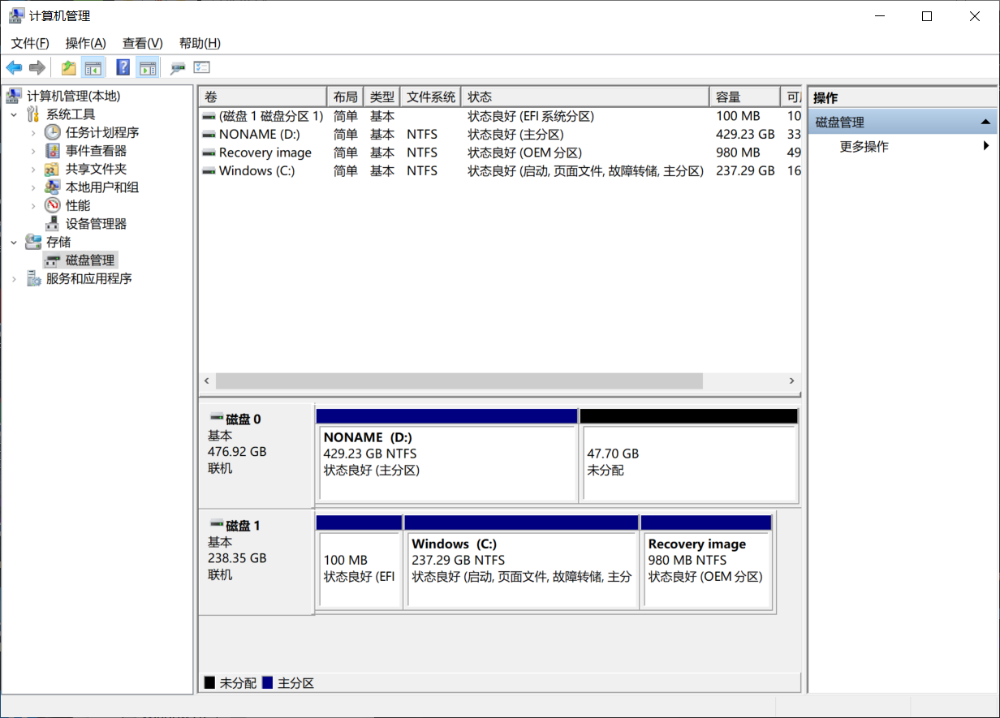
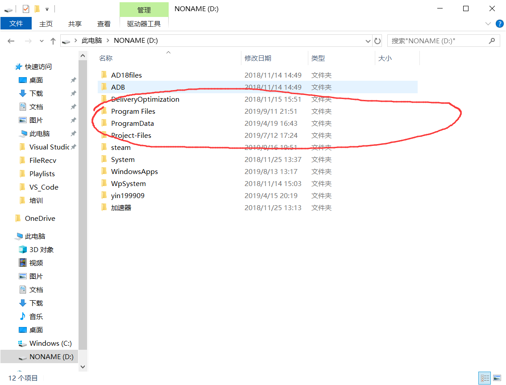

# 学会管理自己的电脑

- [学会管理自己的电脑](#学会管理自己的电脑)
  - [硬盘分区](#硬盘分区)
  - [软件安装](#软件安装)
  - [移动下载文件夹](#移动下载文件夹)

## 硬盘分区

现在的笔记本电脑一般会配置两个硬盘，常见的配置为一个**固态硬盘**(SSD)加一个**机械硬盘**(HDD)，有些电脑也会配置两个**固态硬盘**(很舒服)。可以右键桌面的**此电脑**图标，选择管理，点击左侧磁盘管理，来查看磁盘分区信息以及管理磁盘。  
  

**SSD+HDD**配置：如果SSD空间足够大，可以分配给C盘100GB左右的空间，然后将剩余的SSD空间分配给D盘(作为常用软件盘，将软件装到此分区可以快速启动软件)。HDD则单独配置为一个分区，用来储存一些数据文件和游戏。

**SSD+SSD**配置：这个配置比较少吧，一般都是自己加硬盘以后才会出现。不同条件的配置可以不一样。不过最好将分区控制在3个以内，多了没必要。

**单SSD**配置：如果短期内不考虑买新硬盘(或者电脑不可以扩展硬盘)，请将SSD分为两个区，总空间小的话，C盘可以少给一点空间。原因：C盘的Program Files文件夹需要提权，而某些软件不适合在提权文件夹内运行。在C盘根目录安装软件呢，则会遇到文件夹过多而难以管理的问题。

## 软件安装

推荐安装到系统盘(C盘)以外的分区，首先新建一个文件夹，命名为**Program Files**  

在以后安装软件时，可以将软件安装到该文件夹下(注意一些软件，路径会带*x86*，此时只要删除*x86*即可，*x86*指为32位操作系统开发)

将软件安装在其它硬盘也方便扩展储存(C盘中的数据会在重装系统后丢失)

## 移动下载文件夹

推荐各位小萌新更改一下***下载***文件夹的目录，首先：打开此电脑，然后：右键**下载**，点击**属性**，选择**位置**，点击**移动**，可以在其它分区的目录下面创建一个名为**Downloads**的文件夹，选中文件夹，然后点击**选择文件夹**，然后点击**应用**后，在弹框中选择确认，即可将下载文件夹移动到其它分区中。以后使用浏览器下载文件就不需要更改下载目录了(浏览器默认将文件下载到**下载**中哦)  

