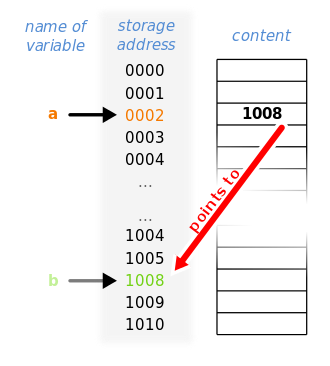
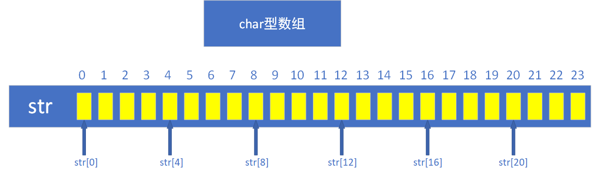
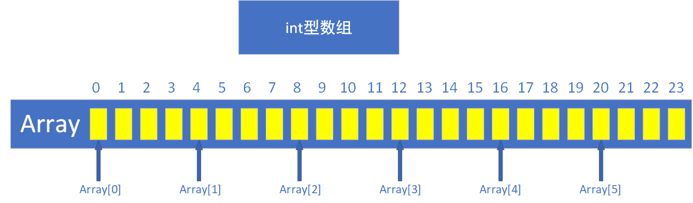
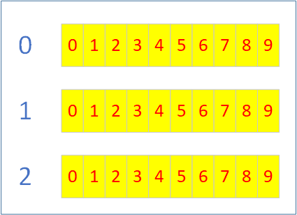
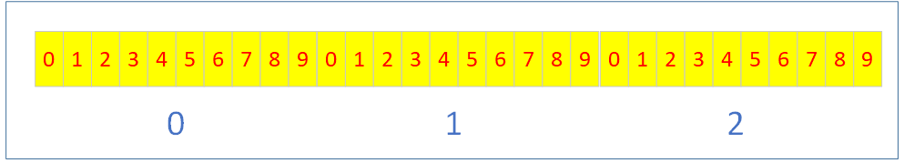

# 指针

- [指针](#指针)
  - [指针是什么](#指针是什么)
  - [指针的优点](#指针的优点)
  - [定义指针变量](#定义指针变量)
  - [指针的运算符](#指针的运算符)
  - [const修饰](#const修饰)
  - [coding环节](#coding环节)
  - [例一](#例一)
    - [例一值传递](#例一值传递)
    - [例一指针传递](#例一指针传递)
    - [例一总结](#例一总结)
  - [例二](#例二)
    - [例二值传递](#例二值传递)
    - [例二指针传递](#例二指针传递)
    - [例二总结](#例二总结)
  - [总结1](#总结1)
  - [二维数组的指针](#二维数组的指针)
    - [Error code](#error-code)
    - [Correct code](#correct-code)
  - [函数指针](#函数指针)
  - [例三](#例三)
    - [例三总结](#例三总结)
  - [例四](#例四)
  - [例五](#例五)
  - [例六](#例六)
  - [总结2](#总结2)
  - [作业](#作业)

## 指针是什么

__指针__ 是一种数据变量类型，它储存了一个寄存器地址，这个地址的值指向储存在该地址的对象的值。

  
_名为 a 的指针，指向一个存储器地址，当中的值为 b。_  
_图片来自[Wikipedia.org](https://zh.wikipedia.org/wiki/%E6%8C%87%E6%A8%99_(%E9%9B%BB%E8%85%A6%E7%A7%91%E5%AD%B8))_

## 指针的优点

指针相对于值传递的速度更快(在相应变量占用储存空间较多的情况下)，值传递在C/C++中是将已有对象复制一份到一个新的内存空间中；而指针则是给出储存数据的位置和数据类型，对数据直接进行操作。

[回到目录](#指针)

## 定义指针变量

定义指针变量比较简单，如下

    int *a;     //定义整型指针变量a
    char *b;    //定义char类型指针变量
    int **c;    //定义(int *)类型指针变量，所谓的二级指针
    char ***d;  //定义(char **)类型的指针变量，所谓的三级指针

    //特殊的指针，void型指针，可以指向任何数据类型
    void* ptr = a;  //OK  指向int类型的数据
    ptr = b;        //OK  指向char类型的数据

指针变量的值中有一个非常特殊的值: **NULL**，它**不**指向系统中的任何变量或者函数。一般，我们使用它作为一个标志(返回指针的函数没有正确执行、到达链表末尾等等)

[回到目录](#指针)

## 指针的运算符

指针的运算符有两个，一个是 **&**，一个是 __\*__

首先说说 **&**，它是取地址运算符（在这里它是单目运算符），使用它可以得到相应变量的储存地址。

其次说说 __\*__，它是指针运算符(或称间接访问运算符)，使用它可以得到指针指向空间的实际值，也可以修改指针指向空间的值。(需要区别于定义变量时，在变量名前写的星号)

举几个例子

    int a = 0;
    int *b = &a;
    int **c = &b; //多级指针赋值
    *b = 1;       //a == 1， 完全等价于 a = 1;
    *(&a) = 2;    //a == 2， 完全等价于 a = 2;

    &(*b) == b;   //先间接访问a，再取出其地址, true
    *(&a) == a;   //先取a的地址，在通过指针间接访问a, true

"&\*"连用表示什么都没干  
"\*&"连用也表示什么都没干

[回到目录](#指针)

## const修饰

在定义指针的时候，可以使用const对其进行修饰，const修饰有两种写法

    int a[2] = {1, 2};
    const int *b = a;   //不能修改指针指向内容的值
    b++;       //合法的
    *b = 2;    //非法的
    int *const c = a;   //不能修改指针变量的值
    *c = 4;    //合法的
    c++;       //非法的

两种const修饰也可以一起用

    int a[2] = {1, 2};
    const int *const b = a;   //既不能修改指针变量的值，也不能修改指针指向内容的值
    b++;      //非法的
    *b = 3;   //非法的

[回到目录](#指针)

## coding环节

## 例一

观察下面两种方法的输出结果有何不同

### 例一值传递

    #include <stdio.h>

    void swap(int a, int b) {
        int c = a;
        a = b;
        b = c;
    }

    int main() {
        int a = 2, b = 3;

        swap(a, b);

        printf("a=%d\tb=%d\n", a, b);
        return 0;
    }

### 例一指针传递

    #include <stdio.h>

    void swap(int* pa, int* pb) {
        int c = *pa;
        *pa = *pb;
        *pb = c;
    }

    int main() {
        int a = 2, b = 3;

        swap(&a, &b);

        printf("a=%d\tb=%d\n", a, b);
        return 0;
    }

### 例一总结

值传递只是拷贝了一份变量的值到新的内存空间，对新内存空间中的变量进行操作，而不会对原有变量造成任何影响。指针操作则直接对原有变量内存空间中的数据进行了修改，从而正确地完成了交换数据的功能。

[回到目录](#指针)

## 例二

对比两种方法的运行时间

### 例二值传递

    #include <stdio.h>
    #include <stdlib.h>
    #include <time.h>

    //定义一个占用空间比较多的变量类型
    typedef struct {
        int a;
        float b;
        double c;
        double d;
        double e;
        double f;
        double g;
        double h;
    } comp;

    int main() {
        comp a, b = {};
        getchar();               //排除执行过程对运行时间产生的影响
        clock_t start = clock(); //记录开始时间
        int i = 0;
        for (; i < 100000000; i++) {
            b.a = i;
            a = b;   //每次执行此条语句都是将comp中的所有变量一个一个的从b赋值到a
        }
        clock_t end = clock();   //记录结束时间
        printf("Used time=%dms\n", end - start);
        return 0;
    }

### 例二指针传递

    #include <stdio.h>
    #include <stdlib.h>
    #include <time.h>

    //定义一个占用空间比较多的变量类型
    typedef struct {
        int a;
        float b;
        double c;
        double d;
        double e;
        double f;
        double g;
        double h;
    } comp;

    int main() {
        comp *a, b = {};
        getchar();               //排除编译过程对运行时间产生的影响
        clock_t start = clock(); //记录开始时间
        int i = 0;
        for (; i < 100000000; i++) {
            b.a = i;
            a = &b;   //只取出b的地址
        }
        clock_t end = clock();   //记录结束时间
        printf("Used time=%dms\n", end - start);
        return 0;
    }

### 例二总结

在变量占用空间较多的情况下，采用指针传值会比普通的值传递快很多

[回到目录](#指针)

## 总结1

上面的两个例子说明了在一些情况下，使用指针赋值来代替传统的赋值操作会让程序运行得更快
而且我们对指针的调用也能够实现对两个变量的值进行交换，或是读取相应变量的值。  

而这时有人或许会对指针为什么还要有不同的类型有所疑问。下面就让我们尝试着运行一下下面
的这串代码。

    #include <stdio.h>

    int main() {
        int array1[10];
        char array2[10];
        printf("数组元素中，第0个元素的地址 %d\n", &array1[0]);
        printf("整型数组的首地址是 %d\n数组中第一个元素的地址是 %d\n", array1, &array1[1]);
        //使用指针加1的效果:
        printf("int型指针加1： %d\n", array1 + 1);
        printf("字符数组的首地址是 %d\n数组中第一个元素的地址是 %d\n", array2, &array2[1]);
        //使用指针加1的效果:
        printf("char型指针加1：%d\n", array2 + 1);
        return 0;
    }

C\C++使用指针的类型来确定一次指针变量 **+1** 需要在内存空间向后移动多少个字节，同时
指针的类型也使得程序能够正确地完成**指针-->值**的转换(这里的"值"指的是指针指向的内存
空间中储存的值)。

其次，上面的程序也证明了数组的首地址与数组名中储存的地址相同！  

下图是一个字符数组在内存空间内的存储结构图，对于字符数组，其指针每加“1”在内存空间内就是将指向的地址向后移动了一个字节(8位)的长度。

下图是一个整型数组在内存空间内的储存结构图，对于整型数组，其指针每加“1”在内存空间内就是将指向的地址向后移动了四个字节(32位)的长度。

[回到目录](#指针)

## 二维数组的指针

运行一下试试

    #include <stdio.h>

    int main() {
        int array[3][10];
        printf("二维数组首地址 %d\n", array);
        printf("第一行一维数组首地址 %d\n", *array);
        printf("二维数组第二行地址 %d\n", array + 1);
        printf("第二行一维数组首地址 %d\n", *(array + 1));
        return 0;
    }

是不是觉得二维数组的指针还是挺好理解的  
那下面来看看提高部分吧

### Error code

    #include <stdio.h>

    int main() {
        int array[3][10] = {};
        int **p = array;
        printf("第1行第0列的值 %d\n", **(p1+1));
        return 0;
    }

好吧，这样居然就报错！我强制转换总行了吧！

    #include <stdio.h>

    int main() {
        int array[3][10] = {};
        int **p = (void**)array;
        return 0;
    }

还错，那怎样才正确嘛！

### Correct code

    #include <stdio.h>

    int main() {
        int array[10][10] = {};
        int(*p1)[10] = array;
        printf("第1行第0列的值 %d\n", **(p1+1));
        return 0;
    }

### 二维数组指针总结

二维数组指针和二级指针的差异来自于内存中储存数组方式的不同
理想的情况下，二维数组储存的方式如下图所示

而在计算机的内存中，考虑到内存空间的总量有限，二维数组是以下图的形式储存的  
也就是说，在C\C++中，二维数组是一个伪二维数组，它本质上就是一个一维数组

[回到目录](#指针)

## 函数指针

函数指针，函数指针，看名字就能看出来，它是一个指向函数的指针。定义方法为:  
\<Typename1\> (*funcPointer)(\<Typename2\>, ...)  
*Typename1* 为函数返回值类型  
*Typename2...* 为函数的形参表  

下面提供一个使用函数指针的例子

## 例三

    #include <stdio.h>

    int func1(int a) {
        return a / 2;
    }

    int func2(int a) {
        return a * 2;
    }

    int main() {
        int (*funcPointer)(int);     //定义函数指针
        funcPointer = func1;
        printf("func1: %d\n", funcPointer(10));   //函数指针的调用
        funcPointer = func2;
        printf("func1: %d\n", funcPointer(10));   //函数指针的调用
        return 0;
    }

### 例三总结

函数指针是一个非常非常有用的工具，下面我们就举一个例子。

[回到目录](#指针)

## 例四

在下面的这个例子中，我们将使用函数指针来指定数组的排序方法(升序 or 降序)

    //请如果现在打开的是C语言的项目，请先新建一个C++的项目
    #include <iostream>
    #include <algorithm>
    using namespace std;

    int array[1000];

    bool cmp(int front, int behind) {  //比较函数(现在是升序)
        return front < behind;
    }

    int main() {
        int n;
        //*****输入数组 Start******
        cin >> n;
        int i = 0;
        for (; i < n; i++) {
            cin >> array[i];
        }
        //****输入数组 End*********
        sort(array, array+n, cmp);  //传入比较函数，告诉sort这个数组从小到大排
        
        for (i = 1; i < n; i++) {   //测试数组排序是否正确
            if (array[i] < array[i - 1]) {
                cout << "Error!\n";
                return -1;
            }
        }
        return 0;
    }

[回到目录](#指针)

## 例五

使用指针进行数组元素交换

啥，怎么又是使用指针交换数组元素？？？？

这次是数组元素万能交换~~~

    #include <stdio.h>

    void swp(void*, unsigned);

    int main() {
        int a[2] = {1, 2};
        double b[2] = {2.4, 3.4};
        swp(a, sizeof(int));
        printf("int数组 %d %d\n", a[0], a[1]);
        swp(b, sizeof(double));
        printf("double数组 %f %f", b[0], b[1]);
        return 0;
    }

    //*******万能数组元素交换器************
    void swp(void* ptr, unsigned size) {
        char a;
        unsigned i;
        char* first, * second;
        first = (char *)ptr;
        second = first + size;
        for (i = 0; i < size; i++) {
            a = first[i];
            first[i] = second[i];
            second[i] = a;
        }
    }
    //**************end*****************

[回到目录](#指针)

## 例六

使用qsort对结构体进行排序  

    #include <stdlib.h>
    #include <stdio.h>

    int array[1000];
    /**
    * 比较函数类型 int funcName(const void *, const void *)
    * 使用const修饰以避免对数组元素值的意外修改
    */
    int cmp(const void *front, const void *behind) {
        return  *(const int *)front - *(const int *)behind;      //将void *指针转换为int *(使用const修饰以避免对数组元素值的意外修改)
    }

    int main() {
        int n;
        scanf("%d", &n);
        int i = 0;
        for (; i < n; i++) {
            scanf("%d", array + i);
        }
        qsort(array, n, sizeof(int), cmp);  //传入四个参数，第一个是数组首地址，第二个是数组长度，第三个是数组中一个元素所占用的字节数，第四个是比较函数
        for (i = 1; i < n; i++) {
            if (array[i] < array[i-1]) {
                printf("Error!\n");      //未正确排序，输出Error，并退出程序
                return -1;
            }
        }
        return 0;
    }

[回到目录](#指针)

## 总结2

指针作为一种高效的传递参数的变量类型，正确地使用可以加快程序运行速度。在C/C++中也有许多用到了指针的地方。例如:qsort,sort函数 cout操作符等。

[回到目录](#指针)

## 作业

又到了最欢快的布置作业时间了

这次的作业是：

### 基础题

使用qsort函数对char数组进行升序排序(字符值参考ASCII码)，有不懂的问自己部门的几位部长~

### 提高题(选做)

自主学习结构体，结构体定义如下

    //C语言的简单写法
    typedef struct {
        int x;
        int y;
    } xy_struct;

    //C++的同学看这里~~
    struct xy_struct {
        int x;
        int y;
    }

然后使用qsort函数对xy_struct结构体数组中的x进行**升序**排序。

    可能用到的知识点，两种运算符："."、"->"，强制类型转换

[回到目录](#指针)
