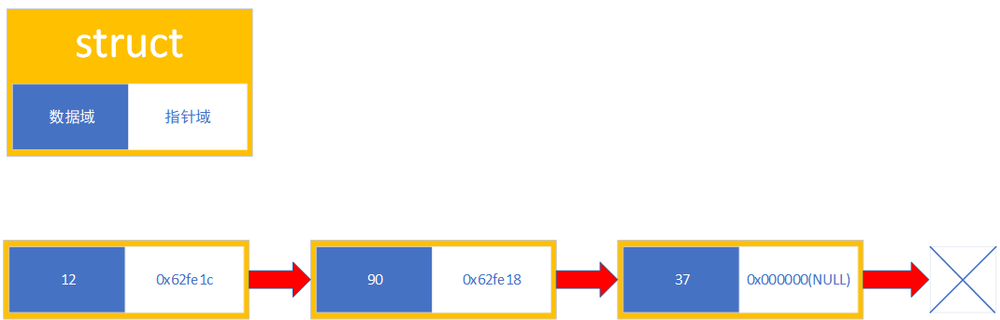

# 链表知识讲解

- [链表知识讲解](#链表知识讲解)
  - [链表是什么](#链表是什么)
  - [链表的作用](#链表的作用)
  - [coding环节](#coding环节)
    - [基础——链表的创建及读取](#基础链表的创建及读取)
    - [进阶——节点删除](#进阶节点删除)
    - [高阶——节点插入](#高阶节点插入)
      - [要求](#要求)
      - [注意事项](#注意事项)
  - [写在最后](#写在最后)

## 链表是什么

__链表__ 是一种常见的数据储存结构，正如它的名字，链表储存数据也就像一条链子一样，是一段接着一段的。

  
_一个单向链表包含两个值: 当前节点的值和一个指向下一个节点的链接_

如上图所示，每一个节点都有**数据域**和**指针域**两部分，数据域用来储存数据，指针域则用来储存链表节点的地址（***单向链表***只存储下一个节点的地址，***双向链表***同数储存前一个节点和后一个节点的指针）

## 链表的作用

__链表__ 的最大作用就是，它能够存储无限的数据（只要硬件支持），而且使用链表不需要提前确定数据的量（可以动态开辟空间），需要多少就可以动态开辟多少。

## coding环节

### 基础——链表的创建及读取

    #include <stdio.h>
    #include <stdlib.h>

    typedef struct _node {
        int data;           //数据域
        _node* next;        //指针域
    } Node;

    int main() {
        int data;
        Node* head = NULL, *Pointer = NULL;
        while (scanf("%d", &data) && data != -1) {
            if (head == NULL) {
                head = (Node*)malloc(sizeof(Node));
                Pointer = head;
            }
            else {
                Pointer->next = (Node*)malloc(sizeof(Node));
                Pointer = Pointer->next;
            }
            // Error处理
            if (Pointer == NULL) {
                printf("Error!\n");
                break;
            }
            else {
                Pointer->data = data;
                Pointer->next = NULL;
            }
        }
        Node* P_next;
        Pointer = head;
        //读取链表数据并删除链表
        while (Pointer != NULL) {
            P_next = Pointer->next;
            printf("%d\t", Pointer->data);
            free(Pointer);
            Pointer = P_next;
        }
        printf("\n");
        return 0;
    }

**使用链表占用的内存空间** = (**8** + **数据空间占用字节数**) X **数据量**

### 进阶——节点删除

    #include <stdio.h>
    #include <stdlib.h>

    typedef struct _node {
        int data;           //数据域
        _node* next;        //指针域
    } Node;

    int main() {
        int data;
        Node* head = NULL, *Pointer = NULL;
        printf("Please input integers...\n");
        while (scanf("%d", &data) && data != -1) {
            if (head == NULL) {
                head = (Node*)malloc(sizeof(Node));
                Pointer = head;
            }
            else {
                Pointer->next = (Node*)malloc(sizeof(Node));
                Pointer = Pointer->next;
            }
            // Error处理
            if (Pointer == NULL) {
                printf("Error!\n");
                break;
            }
            else {
                Pointer->data = data;
                Pointer->next = NULL;
            }
        }

        /**
         *修改的部分
         */
        Pointer = head;
        //回显链表节点数据
        printf("Echo data\n");
        while (Pointer != NULL) {
            printf("%d\t", Pointer->data);
            Pointer = Pointer->next;
        }
        printf("\n");
        Node* P_pre;
        __UINT8_TYPE__ flag = 0;
        //读取链表数据并删除链表
        while (scanf("%d", &data) && data != -1) {
            Pointer = head;
            while (Pointer != NULL) {
                if (Pointer->data != data) {
                    P_pre = Pointer;
                    Pointer = Pointer->next;
                }
                else if (Pointer != head) {
                    P_pre->next = Pointer->next;
                    free(Pointer);
                    printf("Deleted the node.\n");
                    flag = 1;
                    break;
                }
                else {
                    head = Pointer->next;
                    free(Pointer);
                    printf("Deleted the node.\n");
                    flag = 1;
                    break;
                }
            }
            if (flag == 0)
                printf("Haven't found the node.\n");
            flag = 0;
        }
        Node* P_next;
        Pointer = head;
        //读取链表数据并删除链表
        while (Pointer != NULL) {
            P_next = Pointer->next;
            printf("%d\t", Pointer->data);
            free(Pointer);
            Pointer = P_next;
        }
        printf("\n");
        return 0;
    }

### 高阶——节点插入

__这是一个作业,认真完成。__

#### 要求

1. 创建一个可以写入任意多整型数的链表

2. 随机输入数据，可以按从小到大的顺序储存在链表中

3. 可以回显储存在链表中的数据

4. 在程序结束前，需要删除链表所占用的空间

5. 这点不是要求，可以使用C或者C++编写

#### 注意事项

**指针操作不要越界！**

## 写在最后

链表是一个非常好的数据储存结构，它实现了数据的无限储存，同时又只占用了必要的存储空间，减小了系统的开销。

这应该是最后一个C/C++培训了，虽然没有了培训，**但是！** 有问题可以随时call我，在我能力范围内的问题，我都会帮你们解决的。

### 感谢大家来听我的培训，谢谢
